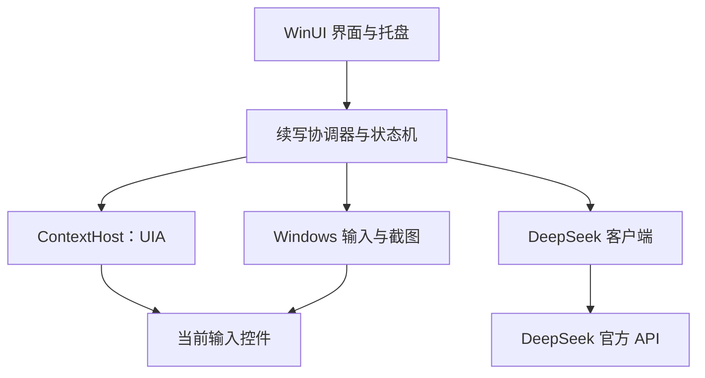

# 软件工程技术方案 v0.1

日期：2026-09-17  
状态：设计完成，尚未进行 Windows 原型验证或真实 API 调用。  
需求依据：[产品需求基线](requirements.md)。本方案细化实现方式，保留已确认的产品默认值。

## 1. 实现决策

采用 C#、.NET 10、WinUI 3 构建桌面应用。主进程负责界面、状态机、快捷键、模型调用、截图和插入；独立的 ContextHost 子进程负责跨应用 UI Automation（UIA）访问。通过进程隔离控制第三方控件阻塞的影响。

模型统一选用 DeepSeek 官方 `deepseek-flash`，显式关闭思考模式，文本和截图使用同一个 API Key。官方当前模型表已列出图像理解支持，Chat Completions 文档提供图片内容块；原需求中的截图能力疑问在文档层面已解决，仍须做真实请求验收。[模型能力](https://api-docs.deepseek.com/zh-cn/quick_start/pricing/)、[请求格式](https://api-docs.deepseek.com/zh-cn/api/create-chat-completion/)

光标模式采用 Unicode 键盘输入插入建议；v1.3 选区模式在采纳时将新增正文复制到剪贴板，保留原文。无法可靠定位光标、识别密码属性或验证插入结果的控件，返回明确的“不支持”或“结果未确认”状态。

“全局生效”指启用后对前台输入控件进行能力检测，不设应用白名单；支持范围由实际控件能力和验收结果决定。

## 2. 平台与构建基线

| 项目 | 工程选择 |
| --- | --- |
| 语言／运行时 | C#、.NET 10；开启 nullable |
| 界面 | WinUI 3；Windows App SDK 稳定通道 |
| SDK 候选 | 官方页面当前标为 2.5.1；在 M0 核实对应 NuGet 包号后精确锁定 |
| Windows 编译目标 | 拟用 net10.0-windows10.0.19041.0，最低平台版本 10.0.17763.0 |
| 架构 | win-x64；目标应用可以为 x86 或 x64，需分别验收 |
| 兼容目标 | Windows 10 1809 及以后、Windows 11；主测 Win10 22H2 和 Win11 24H2／25H2 |
| 运行权限 | 普通用户，asInvoker，不依赖管理员权限或 uiAccess |
| 部署 | unpackaged、自包含目录；先交付 ZIP，后增加每用户安装包 |
| 依赖管理 | global.json、Directory.Packages.props、packages.lock.json 固定版本 |
| 首版裁剪 | 不启用 Native AOT 或激进 trimming，先确保 COM／WinRT 功能可用 |

Windows App SDK 的兼容起点为 Windows 10 1809；官方支持生命周期与“可运行”是不同条件。Windows 10 普通版本的产品兼容性必须由本项目实测确认。[平台](https://learn.microsoft.com/en-us/windows/apps/windows-app-sdk/)、[发布通道](https://learn.microsoft.com/en-us/windows/apps/windows-app-sdk/release-channels)、[.NET 平台支持](https://learn.microsoft.com/en-us/dotnet/core/install/windows)

.NET 和 Windows App SDK 的自包含设置需要分别配置；ZIP 包在无开发工具、无预装运行时的干净 Windows 上验收。M0 同时检查系统依赖，不把构建成功等同于部署完成。[部署依据](https://learn.microsoft.com/en-us/windows/apps/package-and-deploy/self-contained-deploy/deploy-self-contained-apps)

## 3. 工程结构与模块契约

| 工程／目录 | 职责 |
| --- | --- |
| src/AiInput.App | WinUI 设置页、托盘、浮窗、单实例与进程生命周期 |
| src/AiInput.Core | 状态机、版本校验、触发规则、提示词、输出校验；不引用 WinUI |
| src/AiInput.Contracts | IPC 数据对象与版本化协议，不传递 COM 对象 |
| src/AiInput.Windows | 快捷键、会话事件、显示器捕获、输入注入、密钥保护 |
| src/AiInput.ContextHost | UIA MTA 工作线程、焦点与文本事件、上下文提取 |
| src/AiInput.DeepSeek | HttpClient、JSON、SSE、超时与服务错误分类 |
| tests/AiInput.Core.Tests | 请求竞争、状态转换和输出处理的确定性测试 |
| tests/AiInput.Windows.Tests | 可控输入控件上的集成测试 |
| tools/ContextProbe | 只报告能力和耗时的 Windows 诊断原型 |
| docs | 技术方案、验收矩阵和进展记录 |

模块关系：

主要接口：

- `IContextReader.CaptureAsync(epoch, cancellation)`：返回 ContextSnapshot 或明确失败原因。
- `IContextReader.ValidateAsync(targetToken, revision, cancellation)`：重新核验目标及光标。
- `ICompletionClient.GenerateAsync(request, cancellation)`：返回单条完成结果与 finish reason。
- `ITextInserter.InsertAsync(suggestion, validation, cancellation)`：返回 Verified、Rejected 或 Uncertain。
- `IScreenCapture.CaptureOnceAsync(target, cancellation)`：返回有明确所有权的临时图像缓冲。
- `ISecretStore`：只向模型调用模块提供 API Key。
- `ISuggestionPresenter`：显示、隐藏与调整浮窗；不直接插入文字。

ContextSnapshot 包含：前台 HWND、进程 ID 与启动标识、UIA 目标 token、会话 epoch、上下文 revision、光标／选区状态、前后文本、组合输入状态、采样时间。文本上限前后各 300 个 Unicode 文本元素；不得截断代理对或组合字符。字段不输出到日志。

目标 token 只在 ContextHost 当前生命周期有效。保留短生命周期的光标 range clone，在确认前 CompareEndpoints；失效后重新读取。不能用光标矩形或相同文本片段作为光标身份的唯一凭据。

IPC 使用当前用户限定的本地命名管道、父进程随机握手 nonce 和协议版本号；每条消息限制 64 KiB，正文不落盘。ContextHost 不接收 Key，也不发起网络请求。

## 4. 上下文读取

### 4.1 线程与超时

UIA 客户端在 ContextHost 的专用 MTA 线程创建、调用和释放。注册／注销事件由同一工作线程串行管理，事件回调仅排队，避免在 UI 线程或回调中同步读取目标应用。[微软线程建议](https://learn.microsoft.com/en-us/windows/win32/winauto/uiauto-threading)

读取预算暂定 500 ms；超时即丢弃本次结果。Task 超时不会终止阻塞的 COM 调用，因此持续阻塞超过 2 秒后终止并重启 ContextHost，同时清空目标与建议。60 秒内连续重启 3 次后进入暂停并提示，避免不断创建线程或进程。

### 4.2 读取顺序

1. 确认处于可交互的用户桌面，前台窗口不是本软件；读取焦点元素的能力属性。
2. 先检测密码、可编辑、只读、可用和焦点状态，再访问任何文本。IsPassword 为 true、NotSupported、读取失败或信号矛盾时停止。传统 Edit 适配器同时检查密码样式。
3. 优先使用 TextPattern2.GetCaretRange，并要求 isActive=true；其次使用 TextPattern.GetSelection 的唯一零长度选区。v1.3 的非空连续选区进入独立复制模式：只提取选中文字，清空前后文字段，不附带截图；采纳时复制新增内容，插入器明确拒绝选区 token。
4. 从插入点克隆两个范围，分别向前和向后扩展，限量获取文本。首选 TextUnit.Character；provider 提供的单位不可靠时停止或使用经过验证的控件适配器。
5. 提取前再次和提取后再次比较焦点、光标、revision；变化则丢弃快照。
6. 不使用 Ctrl+A/Ctrl+C 获取全文，也不把 ValuePattern 的整段 Value 当作光标前后上下文。

GetCaretRange 提供属于目标控件的零长度光标范围，只有活动焦点时才适合作为输入位置依据；TextPattern 用于访问文本，不提供通用的文本插入事务。[光标接口](https://learn.microsoft.com/en-us/windows/win32/api/uiautomationclient/nf-uiautomationclient-iuiautomationtextpattern2-getcaretrange)、[文本范围](https://learn.microsoft.com/en-us/windows/win32/winauto/uiauto-usingtextrangeobjects)

### 4.3 输入停顿与中文输入法

监听焦点、文本和选区变化；补充键鼠活动仅用于取消陈旧建议与刷新停顿时间，不存储按键序列。1.5 秒从最后一次相关输入或已提交文本变化算起。

组合输入优先查询 TextEditPattern.GetActiveComposition；有组合文本时不发请求、不插入。缺少此能力时，必须通过目标控件适配器证明可以识别提交边界，否则自动续写不可用；“停顿足够久”不能证明中文已上屏。TSF 跨进程集成不作为首版前提。[组合输入接口](https://learn.microsoft.com/en-us/windows/win32/api/uiautomationclient/nf-uiautomationclient-iuiautomationtexteditpattern-getactivecomposition)

启用后优先事件驱动。仅在有活动目标或可见建议时，以最多 4 Hz 的轻量复核弥补漏事件；读取正文只在生成和采纳校验时进行。暂停时不读取正文。事件突发合并处理，不对桌面做全树扫描。

## 5. 状态机与并发规则

`Enabled` 表示全局启用状态，`SessionEpoch` 在暂停、锁屏、解锁或 ContextHost 重建时递增。每次输入／焦点／光标变化递增 `ContextRevision`；每个请求具有唯一 RequestId。

| 状态 | 进入条件 | 下一步 |
| --- | --- | --- |
| Paused | 启动、手动暂停、锁屏、解锁 | 清理建议和请求；启用快捷键进入 Armed |
| Armed | 已启用，等待可用输入目标 | 检测到输入后进入 Debouncing |
| Debouncing | 已提交文本变化 | 静止 1.5 秒并通过目标检查后进入 Generating |
| Generating | 请求已发出 | 有效结果进入 Suggesting；变更即取消并丢弃 |
| Suggesting | 完整建议通过校验 | 手动采纳进入 Inserting；新输入立即隐藏 |
| Inserting | 采纳且二次校验成功 | 确认插入后读取新上下文，继续下一条 |
| SuspendedTarget | 密码、组合输入不明、只读或不支持 | 换目标后重新检测；不改变全局启用意图 |
| Cooldown | 网络错误或限流 | 等待新输入／手动触发和冷却结束；不无限循环 |

任何生成结果必须同时匹配当前 epoch、revision、targetToken、RequestId。取消 HTTP 请求后，仍必须执行版本校验，防止已到达的响应重新显示。

每时刻最多一个逻辑生成请求，只保留最新意图。新输入立即使旧建议失效；界面不等待服务器取消完成。正常同一上下文只自动请求一次，空结果、异常和未采纳不会触发后台连发。

采纳使用原子 consume 标志；快捷键连按只执行一次。全局 Enabled=true 时，Verified 后等待自身文本事件稳定，重新采集真实上下文，立即生成下一条，不再等待 1.5 秒。若用户此时继续输入，重新计时。生成完成后仍等待用户逐条确认。

手动截图在暂停状态可执行一次，完成后回到暂停，不开启持续监听；启动或解锁后不会自动截图。锁屏、密码目标及无输入位置时拒绝手动截图生成。截图只属于当前 RequestId，后续续写不再附带图片。暂停下的单次建议采纳后不自动生成下一条；只有手动启用全局状态后才进入持续续写。

## 6. 安全文本插入

使用 SendInput + KEYEVENTF_UNICODE，按 UTF-16 编码生成对应按下／抬起事件。接受快捷键触发后，先等待 Ctrl、Alt、Enter 实际释放，最长 1 秒；不主动抬起用户仍按住的按键。

插入前重新核验 epoch、前台 HWND、进程身份、焦点元素、零长度选区、组合输入状态、上下文及光标 range。核验和输入注入串行执行，注入前最后再检查前台窗口；任何不一致即作废。

每条建议一次发送完整事件数组，不逐字延时打字。SendInput 返回数量仅表明输入事件被接受，不能作为文本已插入的证明。随后在最长 3 秒内读取目标文本与光标，确认预期插入一次且后文未被覆盖。无法确认时标记 Uncertain，清除旧建议，停止自动续写，不重发、不自动删除或回滚。

Windows 前台切换与输入注入不存在跨应用原子事务；二次校验只能缩小竞态窗口。焦点竞争和输入法行为是发布验收项。若目标控件不能稳定通过该项，不对其启用插入。

SendInput 受 UIPI 限制，普通进程不能可靠地向更高完整性级别应用注入。首版把管理员窗口、UAC 安全桌面列为不支持，不要求用户把助手整体提权。[SendInput](https://learn.microsoft.com/en-us/windows/win32/api/winuser/nf-winuser-sendinput)、[Unicode 输入](https://learn.microsoft.com/en-us/windows/win32/api/winuser/ns-winuser-keybdinput)

不以 SetValue 替换整段文本。首版不使用剪贴板回退，也不保留“插入失败再粘贴一次”的自动重试。

## 7. DeepSeek 接入与生成质量

固定端点 `https://api.deepseek.com/chat/completions`，模型配置集中在内部 ProviderProfile。用户界面只显示 API Key 与连接状态，不要求填写地址或模型名。不根据模型列表随机切换服务或降级到其他供应商。

首版请求使用 `model=deepseek-flash`、`thinking.type=disabled`、`stream=true`、`max_tokens=192`。非思考模式由显式参数关闭；不依赖官方默认值。输出长度另按本地字符规则处理，token 数不等于中文字符数。[官方开关](https://api-docs.deepseek.com/zh-cn/guides/thinking_mode/)

HttpClient 复用，默认不跟随重定向，TLS 使用系统正常验证。SSE 按标准数据帧增量解析，只接收 content，处理空行、keep-alive、拆分 UTF-8 字节、错误帧和正常终止。先在内存中组装完整结果，通过校验后显示；不允许采纳半条流式文本。

文本请求总期限 15 秒，图片请求 30 秒。401／余额不足进入需处理状态；429 遵守 Retry-After，缺省冷却 30 秒；连接失败和 5xx 不对同一上下文自动重放。新意图需满足冷却并保持有效。错误通知走托盘／设置页，建议窗没有正文时保持隐藏。

### 提示词与输出协议

系统提示词：

> v1.2 提示以光标为插入边界，最终文本为 before + 输出 + after；没有后文时完整收束当前段落，有后文时自然衔接已有内容。保留英文首尾连接空格，不复述上下文，不添加换行或说明。

user 消息以 JSON 序列化的 before／after 字段传递文本；截图请求增加一个图片内容块。每次请求独立构造，不附历史聊天、其他应用内容或此前截图。请求不配置 tools，应用不执行模型输出中的操作指令。

输出处理（v1.3）：先要求模型返回 JSON 对象，严格校验 `status` 和 `text` 字段。只有 `status=ok` 的正文进入质量校验；`insufficient_context`、`cannot_continue`、空结果、异常格式、常见拒绝／道歉说明及中断响应只映射为程序内状态，不展示或采纳原始回复。不按字数裁剪，只去除外围 CR/LF；保留连接空格，拒绝内部控制字符、明确上下文回声、工具调用和未完成的 finish reason。请求预算 4096 tokens、90 秒；最多接收 8192 个 UTF-16 单元，超过资源预算整条拒绝并提示，不截断插入、不自动重试。完整内容通过 IPC 传给插入器；长预览可翻页，采纳内容不受可见范围影响。

上线前用独立合成样本评估：工作短句、中文段落、英文夹杂、核物理专业术语、光标位于句中、已有标点与后文。提示词不能保证事实正确，用户逐条采纳机制始终保留。

## 8. 一次性截图链路

1. 快捷键触发时固定输入目标，通过可编辑／非密码／会话检查。
2. 以目标顶层窗口所属显示器为准，跨屏窗口选择与其相交面积最大的显示器；不按鼠标位置选择。
3. 暂时隐藏建议窗，捕获该显示器的当前可见桌面。首选 GDI BitBlt + 内存 DIB，满足低频单张截图需求；黑帧、尺寸异常或目标改变直接失败。GPU／受保护表面的表现必须实测。[BitBlt](https://learn.microsoft.com/en-us/windows/win32/api/wingdi/nf-wingdi-bitblt)
4. 内存中缩放：长边上限 2560 像素，优先 PNG；图片编码超过 8 MiB 时改 JPEG 质量 85 并逐步降低尺寸，最低长边 1280，仍超限则返回失败。8 MiB 是本应用的性能预算。官方当前限制为请求体 48 MiB、inline 单图 32 MiB、单边 8192 像素；本地预算预留 base64 膨胀空间，完整 JSON 请求体再设 12 MiB 上限。[图像限制](https://api-docs.deepseek.com/guides/vision/)
5. 以 image_url 的 base64 data URL 随本次请求发送，detail=high；不用 Files API、外部图床或本地临时文件。[图片字段](https://api-docs.deepseek.com/zh-cn/api/create-chat-completion/)
6. 编码完成即释放像素资源；请求内容序列化发送完成后释放／清零应用持有的编码缓冲，成功、异常和取消统一 finally 清理。发送完成只表示本地写入结束，不声称服务端数据已删除。
7. 后续请求只读取新光标上下文，绝不重用图片、图片摘要或图片 URL。

实现时用可释放 HttpContent 流式写入 base64，避免构造长期存活的大字符串。托管运行时和 HTTP 内部可能产生短期副本，不能承诺逐字节物理擦除；验收保证应用不落盘、不复用、不把图像保留到下一次请求。

全屏截图会包含目标窗口之外的可见内容；密码框排除指输入目标检查，不能保证桌面上其他窗口的敏感内容自动遮盖。设置页明确描述实际截取范围，快捷键只在用户主动触发时捕获。

## 9. 界面、设置与生命周期

设置页使用 WinUI 3：API Key、快捷键状态、浮窗字号与背景透明度、诊断导出。建议窗为独立顶层窗口，采用 WS_EX_NOACTIVATE／TOOLWINDOW、无激活显示及 WM_MOUSEACTIVATE 处理；不为显示建议调用 Activate 或 SetForegroundWindow。[窗口样式](https://learn.microsoft.com/en-us/windows/win32/winmsg/extended-window-styles)

字号初值 16 DIP、背景不透明度 85%、窗口初始宽 420 DIP，均为可调工程初值；只改变背景 alpha，保持文字清晰。Win10 透明合成与 WinUI HWND 组合需 M0 验证，必要时采用原生合成承载浮窗，设置页仍为 WinUI 3。拖拽／缩放不激活目标外窗口。

位置使用显示器标识、DIP 尺寸和相对工作区偏移保存。显示器拔出或 DPI 改变时，把窗口限制在可见工作区；用户调整期间临时冻结自动布局。高对比度模式保持可读。

RegisterHotKey 注册三组默认快捷键并使用 MOD_NOREPEAT。某项冲突时显示具体冲突项并允许重设，不抢占已有快捷键。未注册成功的启用键不能伪装成可用。[快捷键](https://learn.microsoft.com/en-us/windows/win32/api/winuser/nf-winuser-registerhotkey)

启动单实例检查后进入暂停，托盘显示当前状态。关闭设置页保留托盘，退出释放热键、事件和子进程。WTS 会话通知处理锁屏、解锁和断开；锁屏立即取消和清理，解锁仍暂停。电源恢复按暂停处理。[会话通知](https://learn.microsoft.com/en-us/windows/win32/api/wtsapi32/nf-wtsapi32-wtsregistersessionnotification)

## 10. 本地数据与诊断

API Key 采用 DPAPI CurrentUser 保护，密文存于用户 LocalAppData 下，设置页只显示掩码。普通 JSON 保存浮窗、快捷键等设置，不保存 Key、正文或截图。配置以临时文件加原子替换写入，版本迁移失败回到默认暂停。[ProtectedData](https://learn.microsoft.com/en-us/dotnet/api/system.security.cryptography.protecteddata?view=windowsdesktop-10.0)

日志采用固定允许字段：时间、软件版本、事件代码、状态、随机请求 ID、耗时、HTTP 状态码、异常类型和 HRESULT。禁止任意对象 ToString、完整异常消息／服务错误体、窗口标题、UIA Name/Value、按键、输入文字、建议、正文散列、Authorization 或图片数据。

每份日志最大 2 MiB，保留 5 份。导出包只含上述日志与脱敏配置，不包含 Key 密文，不附崩溃内存转储；不自动发送。用合成敏感标记检查成功、超时、异常和导出路径均无泄漏。

## 11. 性能与验收目标

以下为工程目标，尚无实测数据：

- 前台输入事件到旧建议隐藏：p95 ≤100 ms。
- 1.5 秒停顿后调度误差：正常负载下 ±100 ms。
- UIA 单次读取 p95 ≤200 ms，500 ms 超时丢弃。
- 文本请求完整返回到浮窗显示 p95 ≤100 ms；云端总响应时间单独统计。
- 暂停状态不读取正文、不截图、不发自动生成请求。
- 空闲进程组 CPU 目标 <1%，主进程和 ContextHost 合计工作集目标 <250 MiB，单张截图峰值另计。
- 错目标插入、重复插入、覆盖已有后文和敏感日志泄漏为阻断发布的问题，不能用平均成功率掩盖。

具体用例、测试环境及证据格式见[验收矩阵](acceptance.md)。

## 12. 实施顺序与退出条件

| 里程碑 | 交付物 | 进入下一阶段的条件 |
| --- | --- | --- |
| M0 工程与系统原型 | 可构建解决方案、ContextProbe、无焦点浮窗原型、版本锁文件 | 在 Win10/11 证明上下文／IME／插入可行，完成实际 NuGet 与部署依赖核验 |
| M1 文本闭环 | 设置、暂停启用、停顿生成、短建议、采纳与连续下一条 | 模拟网络竞争测试通过；真实 API 文本请求通过；零错误插入 |
| M2 截图与数据生命周期 | 单屏捕获、图像请求、发送后清理、无历史图像复用 | 一次性图片和清理用例通过；真实 API 图像请求通过 |
| M3 兼容性与交付 | Win10/11 报告、ZIP、每用户安装包、使用说明 | 发布阻断项全部通过；干净系统安装／卸载成功 |

M0 先解决控件能力和无焦点交互，再扩展界面。实际 Windows 桌面、输入法与付费 API 的验证均不能用当前文档调研替代。没有有效 API Key 时，用模拟服务完成状态机与网络层开发，真实调用项保持未验证。

本轮只交付技术设计，不生成未经验证的安装包；下一阶段按 M0 开始实施。
